# Auth0 integration steps
[Official documentation](https://auth0.com/docs/get-started/architecture-scenarios/spa-api/part-2#auth0-configuration)

## Setting up your account 

1. Create an Auth0 account at [Auth0](https://auth0.com/).
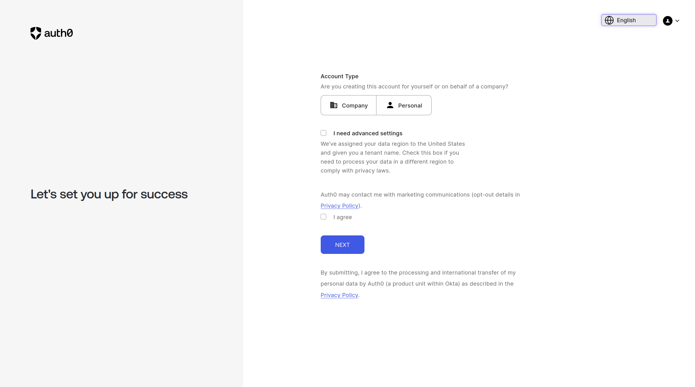
2. Set up the tenant domain and other settings as per your requirements.
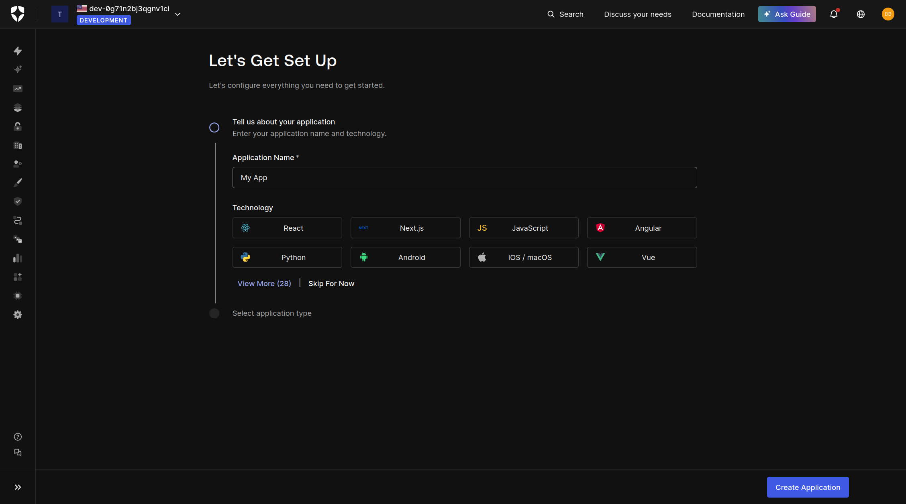
    - In our case select React and Single Page Application as the application type (Should be automatic).
3. Click "Create Application"

## Create the application
1. Go to the settings page of your application and note down the following details:
    - Domain
    - Client ID
    - Client Secret
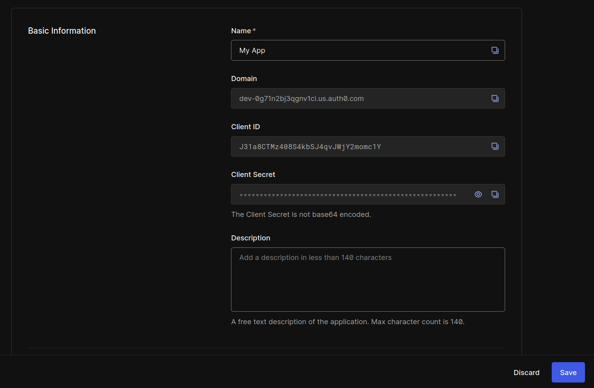

2. Add the callback URL for your application (e.g., `http://localhost:3000/callback` for local development).
3. Add the allowed logout URL for your application (e.g., `http://localhost:3000` for local development).
4. Add the allowed web origins for your application (e.g., `http://localhost:3000` for local development).
5. Save the changes.

## Create an API for the Spring Boot backend
1. Go to the "APIs" section under "Applications" in the Auth0 dashboard.
2. Click "Create API".
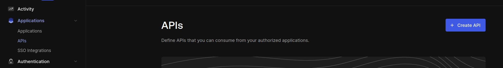
3. Fill in the details:
    - Name: Your API name (e.g., "My Spring Boot API")
    - Identifier: A unique identifier for your API (e.g., `https://myapi.example.com`)
      - This will be used as the audience in your Spring Boot application and frontend application.
    - Signing Algorithm: RS256
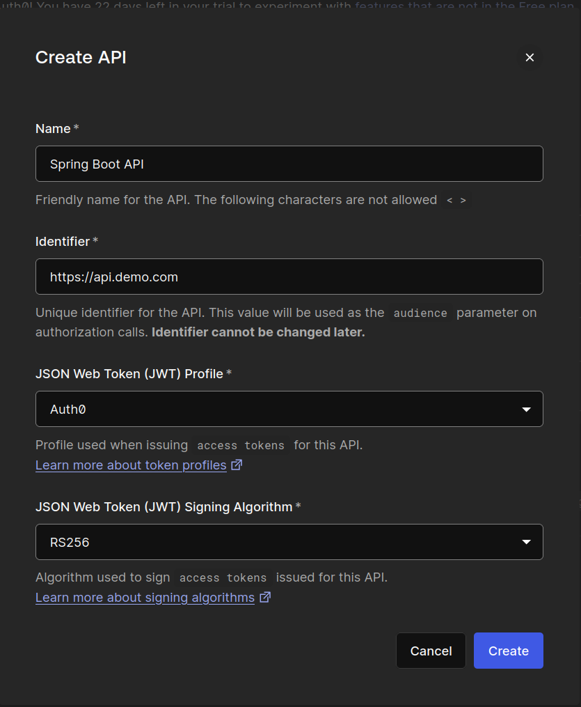
4. Click "Create".

## Set up the application to use Auth0
1. In the environment variables of your frontend application, set the following variables:
```env
REACT_APP_DOMAIN=your-auth0-domain
REACT_APP_CLIENT_ID=your-app-client-id
REACT_APP_CALLBACK_URL=http://localhost:3000/callback
REACT_APP_API_SERVER_URL=http://localhost:8080
REACT_APP_AUDIENCE=your-api-identifier
```
### Client Id and Domain can be found in the application settings page.
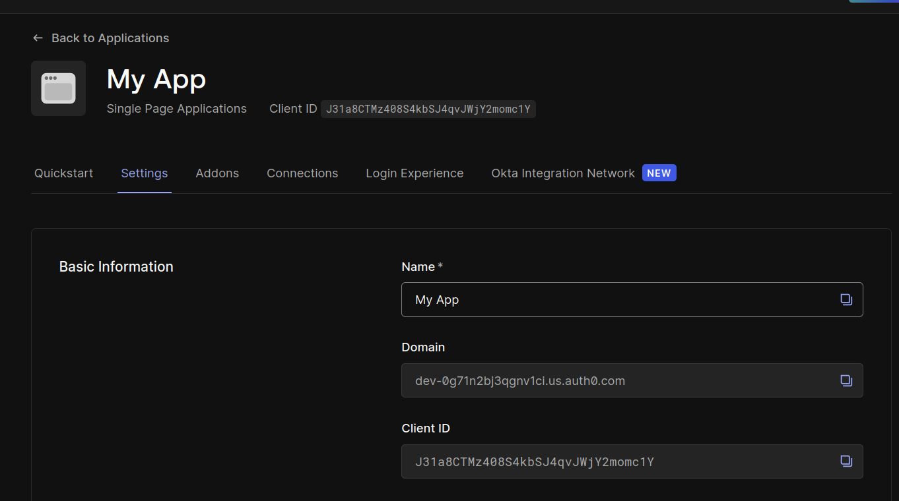

### API Identifier can be found in the API settings page.
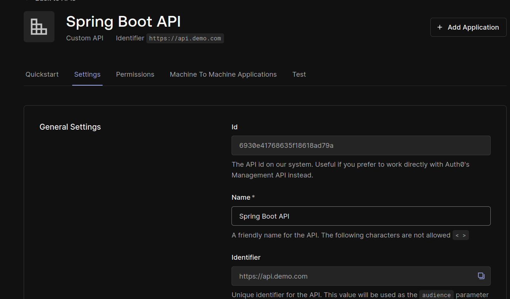

## Set up the Spring Boot application to use Auth0
1. In the `application.yml` file of your Spring Boot application , set the following properties:
```yaml
okta:
  oauth2:
    issuer: https://<your-auth0-domain>/
    audience: <your-api-identifier>
```

## Set up authorization and sending permissions in the access token
1. Go to the "APIs" section under "Applications" in the Auth0 dashboard
2. Select the API you created for your Spring Boot backend.
3. Go to the "Permissions" tab and add the required permissions (scopes) for your API.
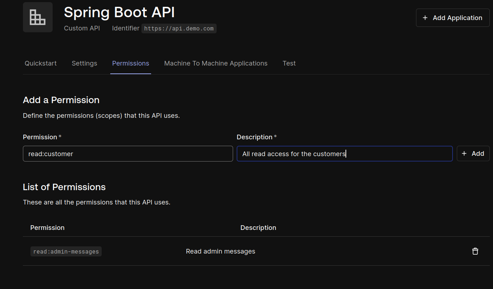
   - `Note:` if you use the code in this repository, I used `read:customer` and `read:admin-messages` permissions for the roles.
   - For example, you might add `read:messages` and `write:messages` permissions.
   - These permissions will be used in your Spring Boot application to secure endpoints. (e.g., `@PreAuthorize("hasAuthority('read:admin-messages')")`)

## Create a role and add permissions to it
1. Go to the "Roles" section under "User Management" in the Auth0 dashboard.
2. Click "Create Role".
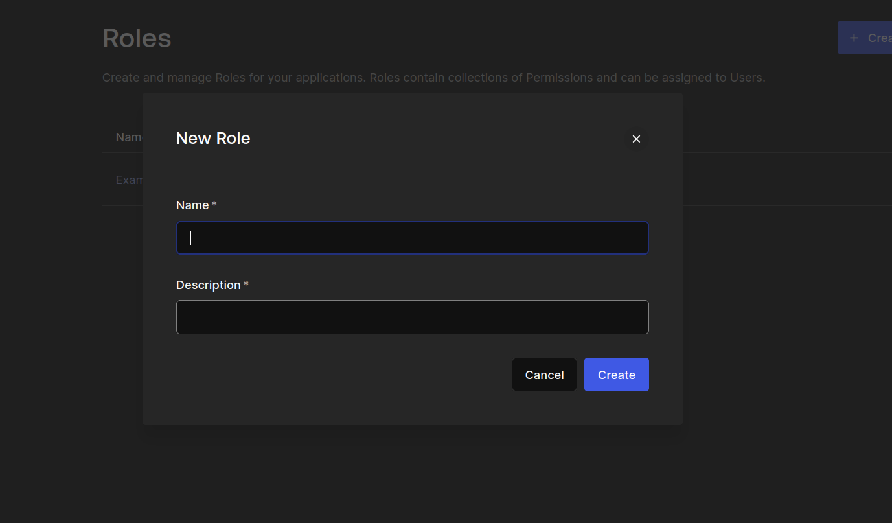
3. Fill in the details:
    - Name: Your role name (e.g., "default-role")
    - Description: A brief description of the role.
4. Click "Create".
5. After you will be redirected to the role details page, go to the "Permissions" tab.
   - Otherwise, you can click on the role from the roles list to go to the role details page.
6. Click "Add Permissions" and select the permissions you created for your API.
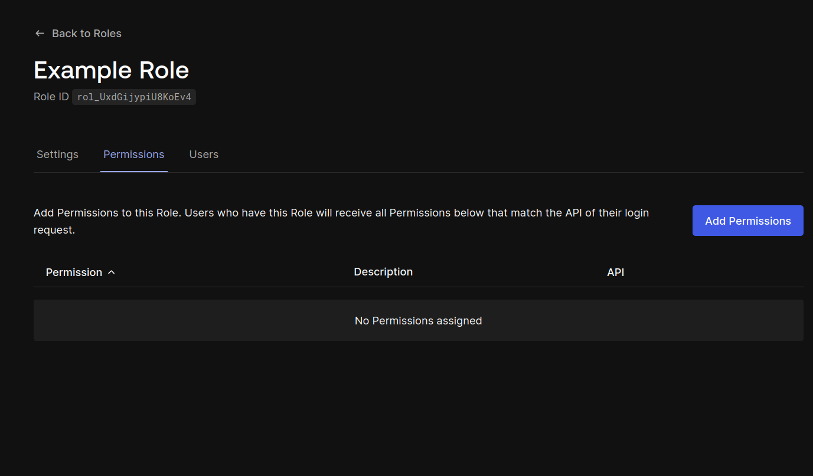
7. Select the API and the permissions to add to the role, then click "Add Permissions".
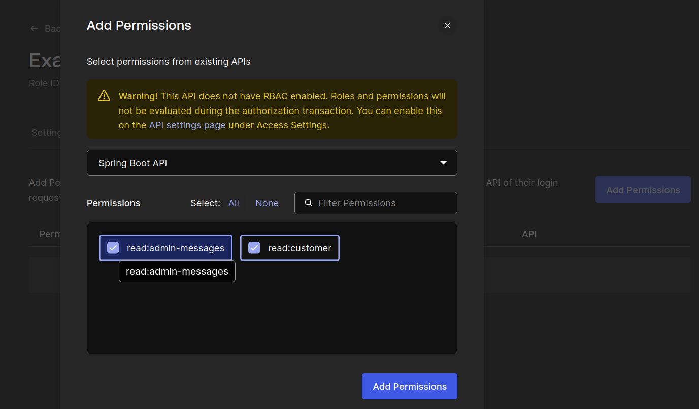

### RBAC warning

You should see a warning at the top of the page indicating that RBAC is not enabled for the API.
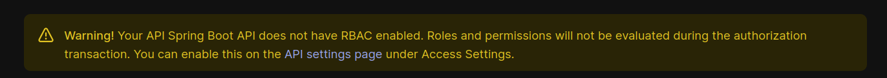

Click on the link in the warning to go to the API settings page, and scroll down to the "RBAC Settings" section.
Enable the "Enable RBAC" and "Add Permissions in the Access Token" options, then click "Save".
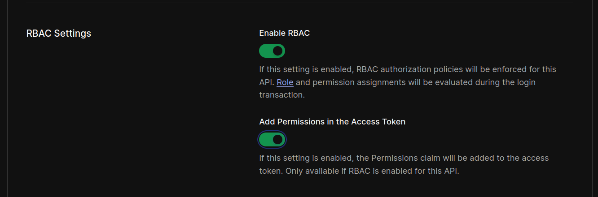

## Add role to a user
1. Go to the "Users" section under "User Management" in the Auth0 dashboard.
2. Click on a user to view their details.
3. Go to the "Roles" tab and click "Assign Roles".
4. Select the role you created earlier and click "Assign Roles".
5. The user should now have the role assigned.

## Conclusion 
You have successfully set up Auth0 authentication and authorization for your React frontend and Spring Boot backend applications. You can now use Auth0 to manage users, roles, and permissions in your applications.

# Auth0 action to add default role

### Environment Variables
These can be found in the Auth0 Management API applications settings.
You can also read the documentation [here](https://auth0.com/docs/manage-api-clients/manage-applications/create-management-api-application).
```dotenv
domain=your-auth0-domain
clientId=your-management-api-client-id
clientSecret=your-management-api-client-secret
```
### Code
```js
exports.onExecutePostLogin = async (event, api) => {
  // If we want to do it only when the first login is done.
  if (event.stats.logins_count !== 1) {
    return;
  }

  // If we want to make sure the user has a role, and add it whenever none is found
  // if (event.authorization && event.authorization.roles && event.authorization.roles.length > 0) {
  //   return;
  // }

  const ManagementClient = require('auth0').ManagementClient;

  const management = new ManagementClient({
      domain: event.secrets.domain,
      clientId: event.secrets.clientId,
      clientSecret: event.secrets.clientSecret,
  });

  const params =  { id : event.user.user_id};
  // This is the role id you want to be the default role.
  const data = { "roles" : ["default-role-id"] };

  try {
    const res = await management.users.assignRoles(params, data)
  } catch (e) {
    console.log(e)
    // Handle error
  }
};
```
